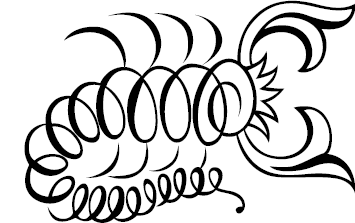

# Drinks menu

The compiled document is at [drinks.pdf](drinks.pdf).

## 0. Install LateX (instructions for Mac users)
If you don't have Homebrew installed yet, install [Homebrew](http://brew.sh/):
```
/usr/bin/ruby -e "$(curl -fsSL https://raw.githubusercontent.com/Homebrew/install/master/install)"
```

If you don't have LateX installed yet, install MacTeX (LateX for Mac):
```
brew cask install mactex
```

## 1. Generate graphics
For each .tex file named `deco-*.tex`, compile it with XeLaTeX.  This should generate a .pdf file containing the graphic.  The picture that each `psvectorian` code can be seen in [psvectorian.pdf](psvectorian.pdf), copied in this repository.

For example,
```tex
\psvectorian{102}
```
will generate the following image:


```
shopt -s extglob
xelatex !(drinks).tex
```

## 2. Generate document
Compile `drinks.tex` with pdfLatex.

```
pdflatex drinks.tex
```
